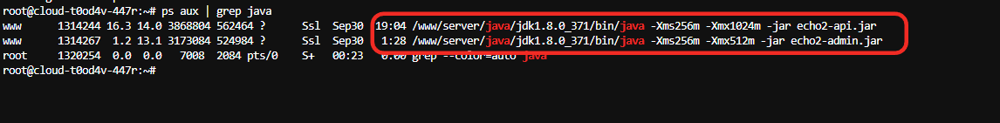

# **systemd 管理Java后端服务**


为交易所的两个 JAR 应用创建两个独立的 systemd 服务：

- `echo2-api.service`
- `echo2-admin.service`

前提：两个jar 文件存放位置都在 `/www/wwwroot/jar `

其次，之前使用sh nohop 运行jar ，在 `/www/wwwroot/jar ` 目录执行 `./kill.sh` 干掉当前进程。

最后，再按照下面的操作进行。

## 1.创建API 的服务文件

```
sudo nano /etc/systemd/system/echo2-api.service
```

内容如下：

```
[Unit]
Description=Echo2 API Service
After=network.target

[Service]
Type=simple
User=www
Group=www
WorkingDirectory=/www/wwwroot/jar
ExecStart=/www/server/java/jdk1.8.0_371/bin/java -Xms256m -Xmx1024m -jar echo2-api.jar
SuccessExitStatus=143
Restart=always
RestartSec=10
StandardOutput=inherit
StandardError=inherit
SyslogIdentifier=echo2-api

[Install]
WantedBy=multi-user.target
```


## 2、创建admin 的服务文件

```
sudo nano /etc/systemd/system/echo2-admin.service
```

内容如下：

```
[Unit]
Description=Echo2 Admin Service
After=network.target

[Service]
Type=simple
User=www
Group=www
WorkingDirectory=/www/wwwroot/jar
ExecStart=/www/server/java/jdk1.8.0_371/bin/java -Xms256m -Xmx512m -jar echo2-admin.jar
SuccessExitStatus=143
Restart=always
RestartSec=10
StandardOutput=inherit
StandardError=inherit
SyslogIdentifier=echo2-admin

[Install]
WantedBy=multi-user.target
```

## 3、设置文件权限

```
sudo chmod 644 /etc/systemd/system/echo2-*.service
```

## 4、启用并启动服务

```
//重载配置
sudo systemctl daemon-reexec
sudo systemctl daemon-reload

//开始启动服务
sudo systemctl start echo2-api.service
sudo systemctl start echo2-admin.service

//查看 API 服务状态
sudo systemctl status echo2-api.service
//查看 Admin 服务状态
sudo systemctl status echo2-admin.service
//正常应该输出active (running)


//日常管理

//重启api服务
sudo systemctl restart echo2-api
//重启admin服务
sudo systemctl restart echo2-admin

//停止api服务
sudo systemctl stop echo2-api
//停止admin服务
sudo systemctl stop echo2-admin
```



## 打赏

如果该项目对您有所帮助，希望可以请我喝一杯咖啡☕️

```bash
# USDT-TRC20打赏地址:
TTz4y9EE5DqtRAneK5iQtWNW4k9E888888
```


## 声明

源码仅用于学习交流使用！

不可用于任何违反中华人民共和国(含台湾省)或使用者所在地区法律法规的用途。

因为作者即本人从未参与用户的任何运营和盈利活动。 

且不知晓用户后续将程序源代码用于何种用途，故用户使用过程中所带来的任何法律责任即由用户自己承担。            

```
！！！Warning！！！
项目中所涉及区块链代币均为学习用途，作者并不赞成区块链所繁衍出代币的金融属性
亦不鼓励和支持任何"挖矿"，"炒币"，"虚拟币ICO"等非法行为
虚拟币市场行为不受监管要求和控制，投资交易需谨慎，仅供学习区块链知识
```

