# 区块链交易所管理操作说明


# 一、主要功能

当前版本功能：U本位合约、现货交易、秒合约，以及理财挖矿功能。

版本有多个分支，根据客户的不同定制需求。

如无特别说明，当前版本是 `V2.20`.


# 二、现货、合约、秒合约


## 2.1 现货交易


## 2.2 秒合约


## 2.3 永续合约U本位


## 2.4 新币发行

若要设置平台币，需要进行以下操作：


平台币设置好后，接下来需要在相应的交易模式里新建平台币的交易对：如现货交易、秒合约交易。

以现货交易为例：


完成后，等待1-10分钟，平台币即可在币币交易中使用。


## 2.5 交割合约（基础版忽略）

交割合约原型来自秒合约，配合跟单使用。

角色有带单人，每一个订单专属跟单码，别人输入跟单码即可跟随此单。

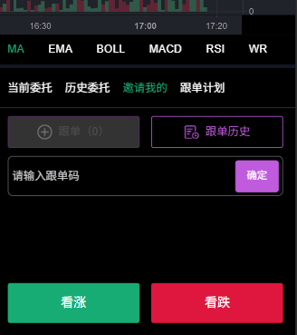

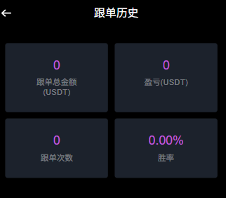

## 2.6 资产类型

用户在平台的资产分为三种：平台资产、理财资产、合约资产。

不同资产可以通过划转来规划资产使用。


# 三、会员管理


会员管理这里可以针对会员进行增删改查，比如上下分，单控等设置。

**注意：系统中涉及到归集等功能需要配合自建节点使用，手动方式或者对接三方优盾系统，则忽略。**


# 四、投资理财挖矿类目


## 4.1 理财

​	理财功能属于定期理财类，使用USDT 参与。

| 天数             | 理财周期                   |
| ---------------- | -------------------------- |
| 违约利率         | 违约后扣除的金额百分比     |
| 最小日利率百分比 |                            |
| 最大日利率百分比 |                            |
| 限购次数         | 参与次数                   |
| 最小金额         | 参与金额显示               |
| 最大金额         | 参与金额显示               |
| 分区显示         | 热销开关                   |
| 数据展示         | 常见问题、介绍、参与进度等 |
|                  |                            |

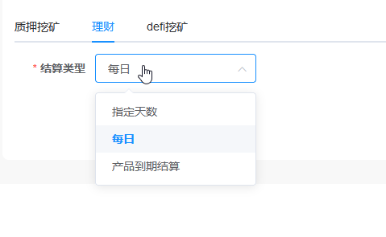

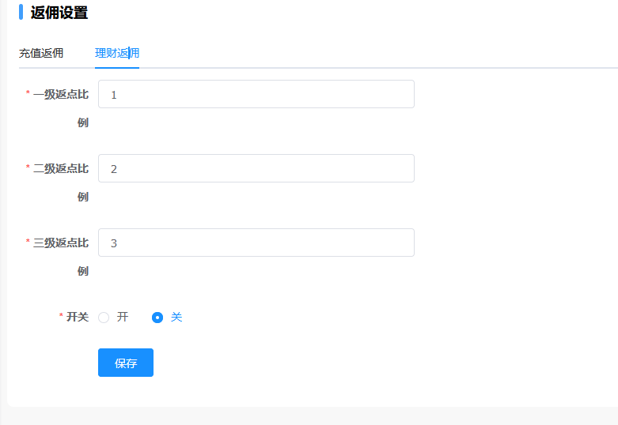

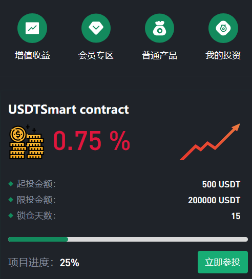

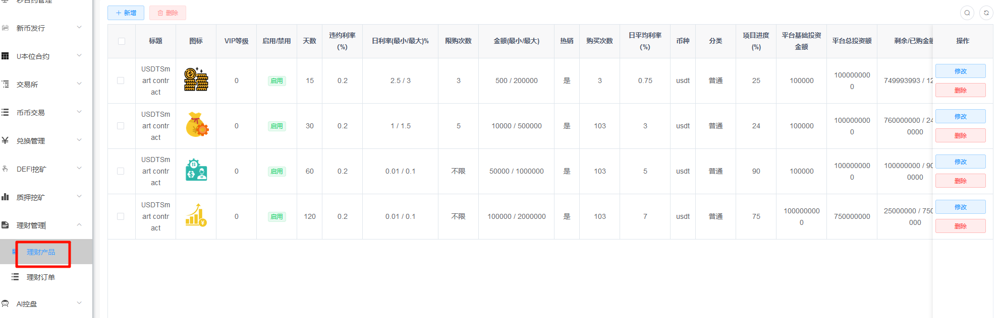

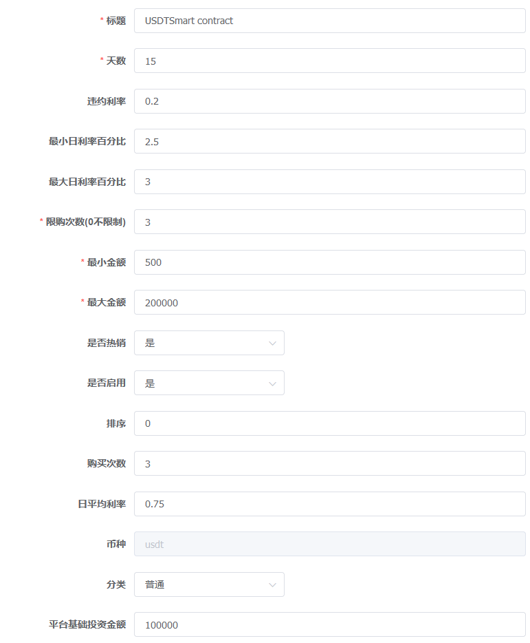

## 4.2 质押挖矿

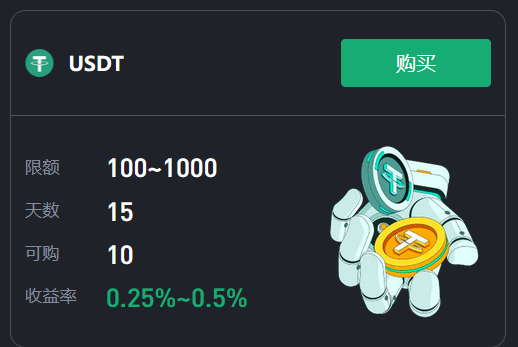


一共动态的理财挖矿，只要一定数量的U 参与，每天随机产生收益。

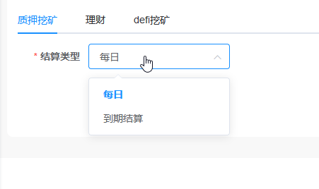

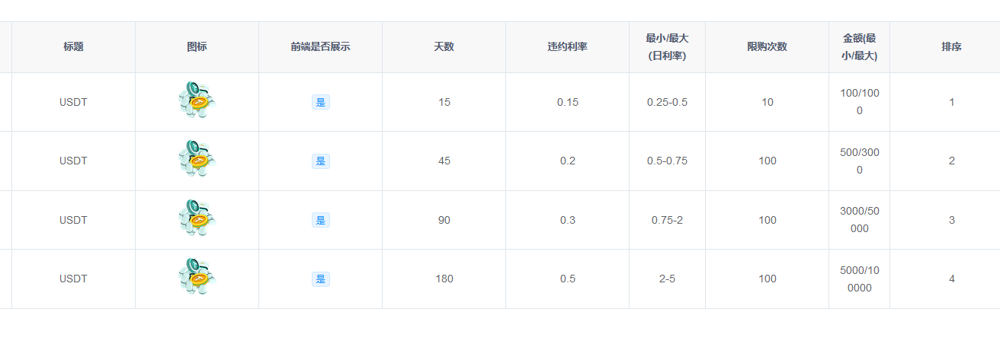

## 4.3 DEFI 挖矿

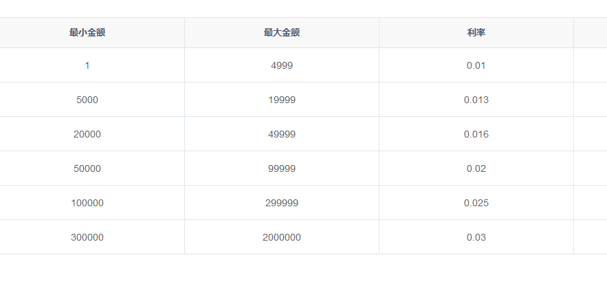

此功能采用智能合约的方式参与理财，即通过web3 钱包授权方式参与，而不是使用用户平台资产。

功能未启用，不少客户担心钱包资产被盗。

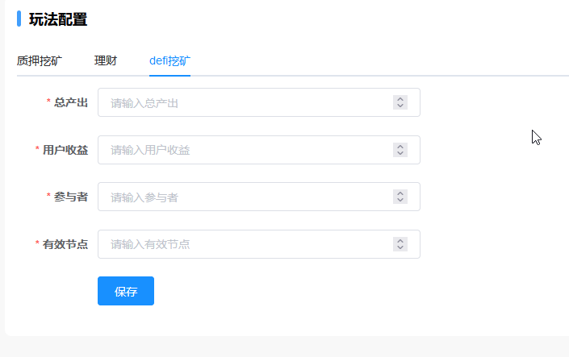


## 4.4 借贷

用户可申请想平台借款，需要支付利息，方式为到期后，本息一次性结清。

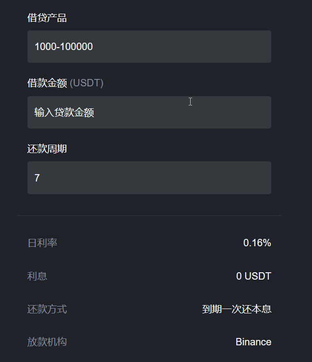


# 五、推广中心

目前的推广分销提示采用的是三级分销，即一代、二代、三代。

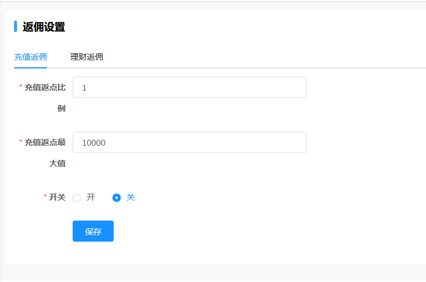

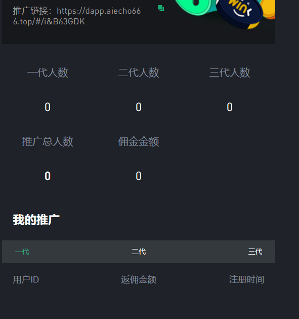


## 5.1 分享推广收益（交割合约版本专有，基础版忽略）

## 

| 等级   | 等级条件              | 奖励分红          |
| ------ | --------------------- | ----------------- |
| 班长   | 三个直推              | 直推1人，10 USDT  |
| 排长   | 团队9人，直推4人      | 直推1人，20 USDT  |
| 连长   | 团队27人，直推5人     | 直推1人，30 USDT  |
| 营长   | 团队81人，直推8人     | 直推1人，40 USDT  |
| 团长   | 团队243人，直推12人   | 直推1人，50 USDT  |
| 旅长   | 团队729人，直推20人   | 直推1人，70 USDT  |
| 师长   | 团队2187人，直推 30人 | 直推1人，90 USDT  |
| 军长   | 团队6561人，直推40人  | 直推1人，120 USDT |
| 司令员 | 团队19683人，直推50人 | 直推1人，150 USDT |

```
备注：
1、团队指的是三级分销，一代、二代、三代；
2、级别（等级条件）注册（注册成功即可）来判定，奖励用充值（激活）来判定
2、奖励分红中的直推1人，即一代人员，首次充值金额 >= 1000，同一个，多次充值，奖励只拿一次；
3、目前充值接口对接优盾，即用户充值金额核算来源是优盾接口；
```


# 六、数据测试

## 6.1 AI控盘


```
操作具体可参考视频：
https://www.youtube.com/watch?v=3zGBxVfGxuI
```

测试完成数据后，需要删除相关的币种测试控制记录 。


## 6.2 单控

可以针对某个会员进行调整测试。测试完成后，请恢复正常功能。


# 七、代理

代理的设计逻辑和管理员类似，区别在于权限的分配 。

代理登录后，可以查看、`修改`名下的会员信息记录。

注意，代理更像一个弱权限的平台人，查看名下人的订单、充值等服务，也可以手动给名下的人上分。

这块适合进行更深一步的二开。


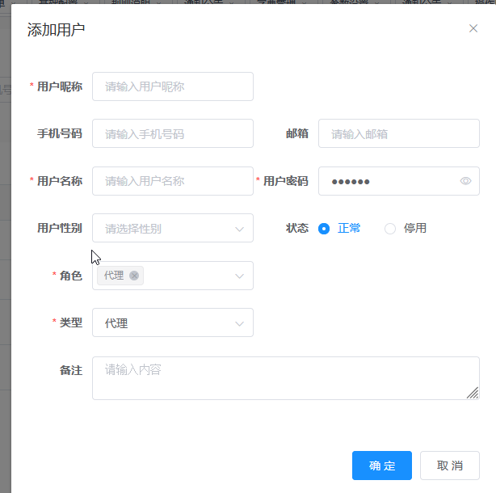


# 八、系统配置


## 8.1 关于币种图标

币种的图标，存储在阿里云OSS中，首先 ，购买完整代码的客户，将系统完整部署好后，登录管理后台，在`系统配置` 中的 `第三方配置` 中设置好OSS 信息：


然后在现有的sql 数据库中，替换部署币种图标的原有oss 地址（这部分涉及到管理后台看到的币种图标不显示问题）。


## 8.2 首页轮播图更换

首先先配置好OSS 信息，


## 8.3 充值方式

基础版默认的充值方式是手动确认；

交割合约版本新增了优盾钱包充值；

可自由二次开发，例如本地搭建钱包节点对接。


## 8.4 注册登录

三种方式：

| 账号+密码      | 无需任何认证，直接注册成功             |
| -------------- | -------------------------------------- |
| 邮箱+密码      | 需要配置STMP ，例如谷歌邮箱            |
| TP钱包授权登录 | web3 或者小狐狸钱包授权，几乎没启用    |
| 手机号         | 需要重新对接短信服务商，太多小厂不稳定 |


## 8.5 关于客服

交易所没有提供客服功能，因客服系统的特殊串流方式，和交易所集成，会有很大的安全隐患，所以客服可以对接三方，或者自建。


## 8.6 文本编辑

平台的一些说明文字、规则、协议等文字都可以在后台进行编辑处理。

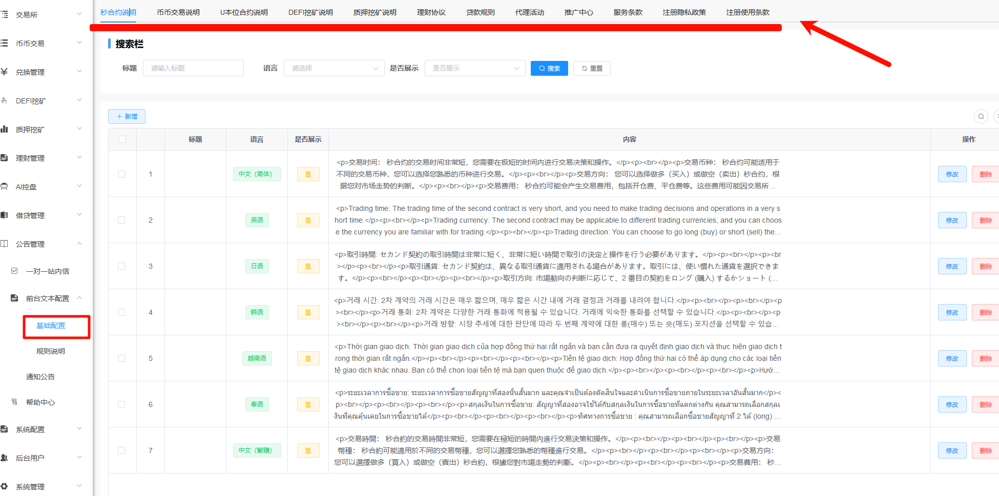

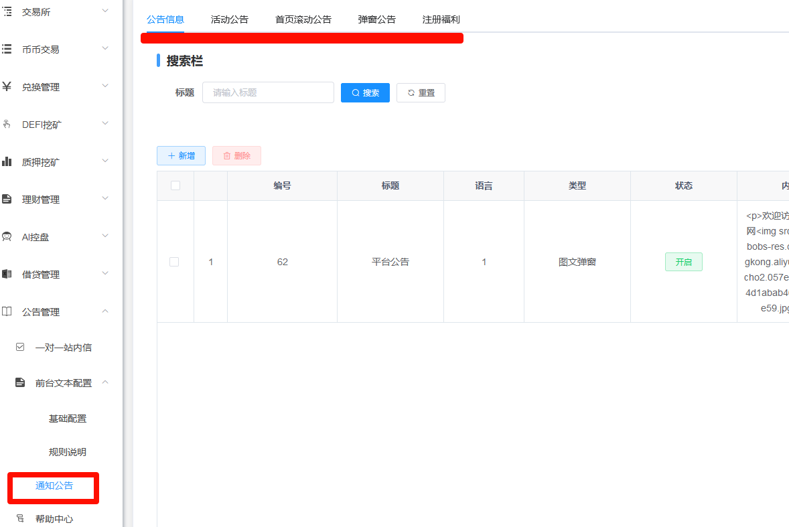


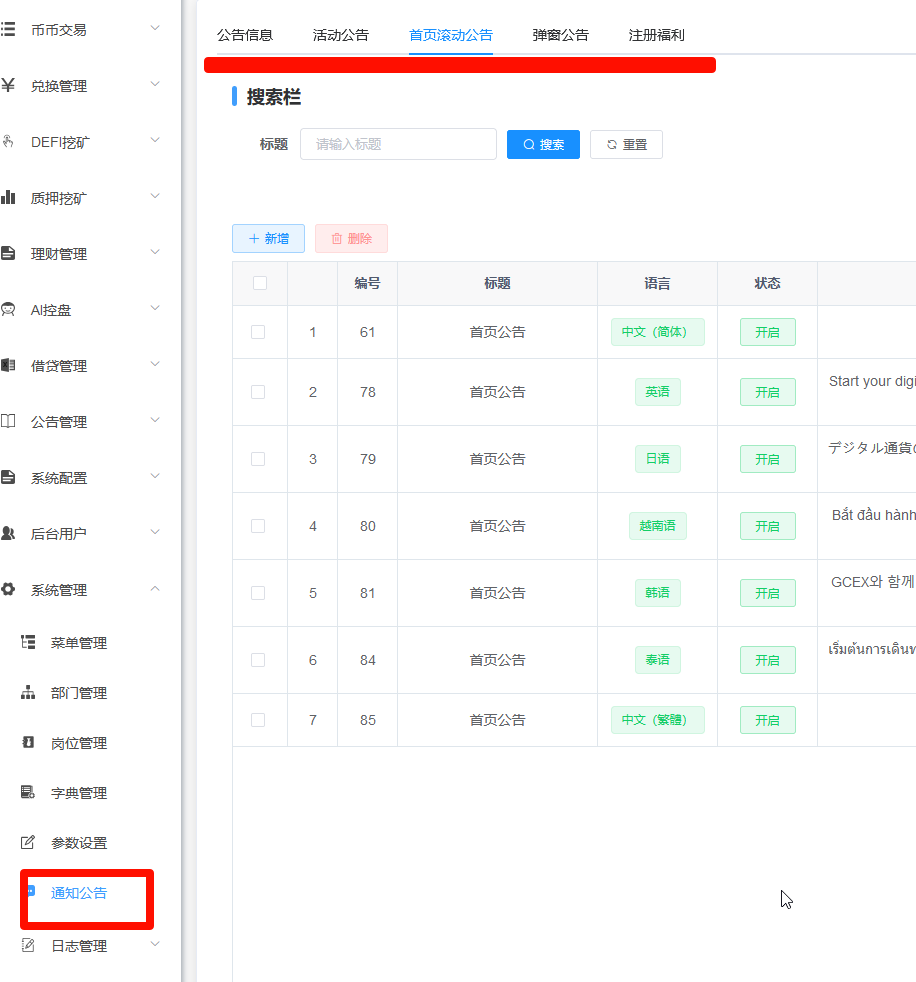


## 打赏

如果该项目对您有所帮助，希望可以请我喝一杯咖啡☕️

```bash
# USDT-TRC20打赏地址:
TTz4y9EE5DqtRAneK5iQtWNW4k9E888888
```


