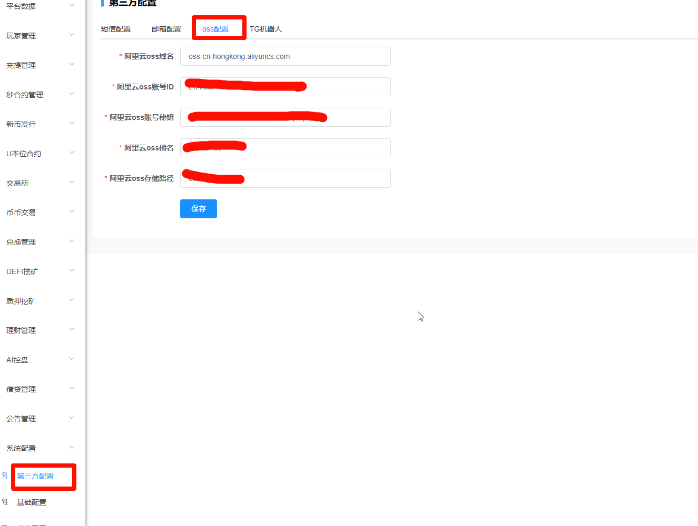

# 区块链交易所管理操作说明

# 一、主要功能

当前版本功能：U本位合约、现货交易、秒合约，以及理财挖矿功能。

版本有多个分支，根据客户的不同定制需求。

如无特别说明，当前版本是 `V2.20`.

# 二、现货、合约、秒合约

## 2.1 现货交易

## 2.2 秒合约

## 2.3 永续合约U本位

## 2.4 新币发行

若要设置平台币，需要进行以下操作：

平台币设置好后，接下来需要在相应的交易模式里新建平台币的交易对：如现货交易、秒合约交易。

以现货交易为例：

完成后，等待1-10分钟，平台币即可在币币交易中使用。

## 2.5 AI控盘

测试完成数据后，需要删除相关的币种测试控制记录 。

# 三、会员管理

会员管理这里可以针对会员进行增删改查，比如上下分，单控等设置。

**注意：系统中涉及到归集等功能需要配合自建节点使用，手动方式或者对接三方优盾系统，则忽略。**

# 四、系统配置

## 4.1 关于币种图标

币种的图标，存储在阿里云OSS中，首先 ，购买完整代码的客户，将系统完整部署好后，登录管理后台，在`系统配置` 中的 `第三方配置` 中设置好OSS 信息：

然后在现有的sql 数据库中，替换部署币种图标的原有oss 地址（这部分涉及到管理后台看到的币种图标不显示问题）。

## 4.2 首页轮播图更换

首先先配置好OSS 信息，

