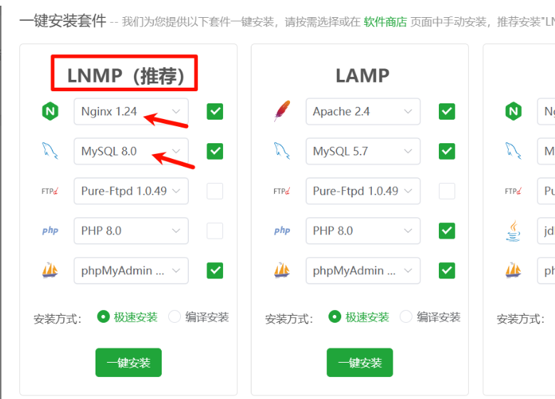
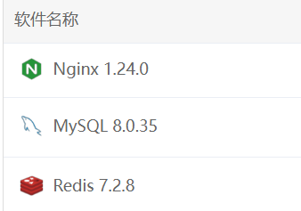

# 前言

本部署说明适用于默认版本、交割合约跟单版本。

额外问题可以私聊


<h1 id="FYyU8">清单</h1>

| Finalshell | SSH 软件，连接服务器安装宝塔使用 |
| ---------- | -------------------------------- |
| Notepad++  | 修改代码软件                     |
| Vmware     | 虚拟机软件                       |
| 服务器系统 | Ubuntu Server 22.04 LTS 64位     |
| 服务器配置 | 4H 8G 200G 硬盘 10M 带宽 +       |


<h1 id="RJcEw">一、服务器运行环境</h1>


**安装宝塔，或使用开心版宝塔【开心版】**

```plsql
if [ -f /usr/bin/curl ];then curl -sSO http://bt950.hostcli.com/install/install_panel.sh;else wget -O install_panel.sh http://bt950.hostcli.com/install/install_panel.sh;fi;bash install_panel.sh www.HostCLi.com
```


<h2 id="la60Z">服务器需要的软件及其版本</h2>

| Nginx    | 1.24   |
| :------- | :----- |
| MySQL    | 8.0.35 |
| Redis    | 7.2    |
| JDK 环境 | 1.8    |


数据库配置文件增加

```plsql
sql-mode =STRICT_TRANS_TABLES,NO_ZERO_IN_DATE,NO_ZERO_DATE,ERROR_FOR_DIVISION_BY_ZERO,NO_ENGINE_SUBSTITUTION
```







<h1 id="WAE8m">二、本地编译环境</h1>


| <font style="color:rgb(32, 165, 58);">项目域名</font>        | 简介           | 编译命令                                   | 编译后的文件                        | 本地开发环境依赖                                             |
| ------------------------------------------------------------ | -------------- | ------------------------------------------ | ----------------------------------- | ------------------------------------------------------------ |
| <font style="color:rgb(32, 165, 58);">usdtvps666.aiecho666.top</font> | 后台管理 web   | `pnpm install && pnpm build`               | dist,开启 SSL                       | `nodejs 18.20.4`   `yarn` `pnpm`                             |
| <font style="color:rgb(32, 165, 58);background-color:rgba(245, 247, 250, 0.416);">dapp.aiecho666.top</font> | wap h5端       | `yarn && yarn build`                       | dist,开启 SSL                       | `nodejs 18.20.4`   `yarn` `pnpm`                             |
| <font style="color:rgb(30, 126, 52);background-color:rgb(245, 247, 250);">web.aiecho666.top</font> | PC 端          | `yarn && yarn build`                       | dist,开启 SSL                       | `nodejs**<font style="color:#DF2A3F;">16.20.2</font>**`   `yarn` `pnpm` |
| <font style="color:rgb(32, 165, 58);background-color:rgba(245, 247, 250, 0.773);">adminapi.aiecho666.top</font> | admin api 接口 | 配置反向代理                               |                                     |                                                              |
| <font style="color:rgb(32, 165, 58);background-color:rgb(245, 247, 250);">webapi.aiecho666.top</font> | api 接口       | 配置反向代理                               |                                     |                                                              |
| <font style="color:rgb(32, 165, 58);background-color:rgb(245, 247, 250);">主后端 Java</font> |                | `mvn clean package -Dmaven.test.skip=true` | target/api.jar<br/>target/admin.jar | jdk1.8 、maven                                               |


```plsql
//在虚拟机中，对三个前端项目进行域名批量替换，使用Notepad++ 软件。

1、admin web项目需要替换域名：adminapi.aiecho666.top

2、H5 项目替换域名：webapi.aiecho666.top

3、PC 项目替换域名：webapi.aiecho666.top

4、Java后端项目不需要替换域名，但是需要注意里面的数据库、redis 密码配置，具体在：
```


# 三、服务器部署


## 3.1 创建站点


 `usdtvps666.aiecho666.top` ------管理员后台占地案

 `dapp.aiecho666.top` ------手机 wap 端

 `web.aiecho666.top` ------PC 端

 `webapi.aiecho666.top` ------API

 `adminapi.aiecho666.top` ------API


## 3.2 数据库初始化导入

Mysql数据库的账号密码和Redis密码，需要和Java代码 dev配置文件对应！


## 3.3 java部署

### 宝塔安装jdk1.8 并配置 Java 环境变量

```
nano ~/.bashrc
//增加下面两行
export JAVA_HOME=/www/server/java/jdk1.8.0_371
export PATH=$JAVA_HOME/bin:$PATH
//刷新配置
source ~/.bashrc

配置好后，可以直接nohup 执行jar。
```


## 3.4 配置 api 站点的反向代理


### webapi 配置转发：

```
location ^~ / { 
      proxy_pass http://127.0.0.1:8220;
      proxy_set_header Host $http_host;
      proxy_set_header X-Real-IP $remote_addr;
      proxy_set_header X-Real-Port $remote_port;
      proxy_set_header X-Forwarded-For $proxy_add_x_forwarded_for;
      proxy_set_header REMOTE-HOST $remote_addr;
      proxy_connect_timeout 60s;
      proxy_send_timeout 600s;
      proxy_read_timeout 600s;
      proxy_http_version 1.1;
      proxy_set_header Upgrade $http_upgrade;
      proxy_set_header Connection Upgrade;
     }
```


### adminapi 配置转发：

```
location ^~ / { 
      proxy_pass http://127.0.0.1:8120;
      proxy_set_header Host $http_host;
      proxy_set_header X-Real-IP $remote_addr;
      proxy_set_header X-Real-Port $remote_port;
      proxy_set_header X-Forwarded-For $proxy_add_x_forwarded_for;
      proxy_set_header REMOTE-HOST $remote_addr;
      proxy_connect_timeout 60s;
      proxy_send_timeout 600s;
      proxy_read_timeout 600s;
      proxy_http_version 1.1;
      proxy_set_header Upgrade $http_upgrade;
      proxy_set_header Connection Upgrade;
     }
```

### 交割合约跟单版本配置转发-后台管理站点

```
location /api/ {
    proxy_pass http://127.0.0.1:8120/api/;
    rewrite ^/api/(.*)$ /$1 break;
    proxy_set_header Host $host;
    proxy_set_header X-Real-IP $remote_addr;
    proxy_set_header X-Forwarded-For $proxy_add_x_forwarded_for;
    proxy_set_header X-Forwarded-Proto $scheme;

    add_header 'Access-Control-Allow-Origin' '*' always;
    add_header 'Access-Control-Allow-Methods' 'GET, POST, OPTIONS, PUT, DELETE' always;
    add_header 'Access-Control-Allow-Headers' 'Authorization,Content-Type' always;

    if ($request_method = 'OPTIONS') {
        return 204;
    }
}
```


最后，启动jar 即可。


## 声明

源码仅用于学习交流使用！

不可用于任何违反中华人民共和国(含台湾省)或使用者所在地区法律法规的用途。

因为作者即本人从未参与用户的任何运营和盈利活动。 

且不知晓用户后续将程序源代码用于何种用途，故用户使用过程中所带来的任何法律责任即由用户自己承担。            

```
！！！Warning！！！
项目中所涉及区块链代币均为学习用途，作者并不赞成区块链所繁衍出代币的金融属性
亦不鼓励和支持任何"挖矿"，"炒币"，"虚拟币ICO"等非法行为
虚拟币市场行为不受监管要求和控制，投资交易需谨慎，仅供学习区块链知识
```

