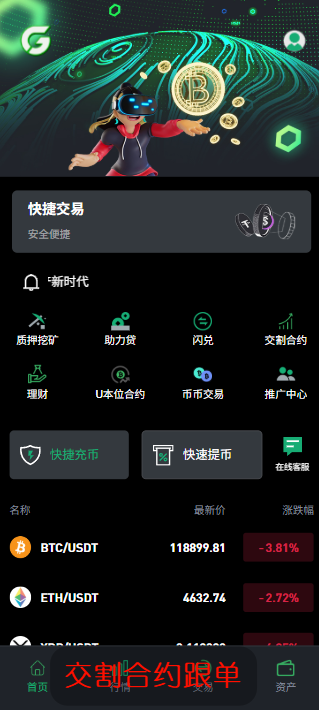
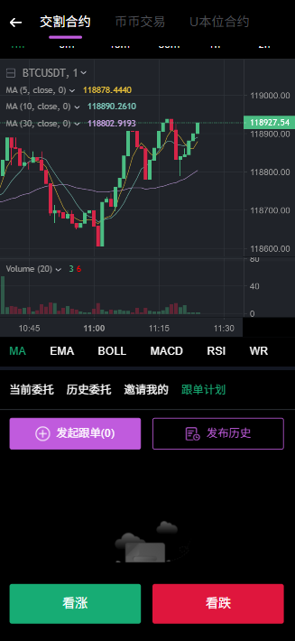

# 前言

> [!NOTE]
>
> ###### 新版本交易所合约代码、dapp系统都是团队一手开发，非二手倒卖，请认准核实！

当前版本功能有U本位合约、现货交易、秒合约，以及理财挖矿功能功能。

版本有多个分支，根据客户的不同定制需求（例如交割合约跟单码形式跟单、直销结算多级奖金分红等）。

如无特别说明，

当前默认版本是 `V2.20`

合约跟单版本：`V6.20`

# 项目架构设计分析

## 1. 整体架构模式

这是一个基于**SpringCloud + Maven多模块**的**分层架构**项目，采用了**微服务设计思想**，主要包含两个独立的应用程序入口：

- **ruoyi-admin**: 管理后台应用
- **ruoyi-api**: API服务应用

## 2. 模块架构层次

```
┌─────────────────────────────────────────────────────────────┐
│                    应用层 (Application Layer)                │
├─────────────────────────────────────────────────────────────┤
│  ruoyi-admin (管理后台)    │    ruoyi-api (API服务)        │
│  • AdminApplication       │    • ApiApplication           │
│  • Web控制器              │    • REST API                 │
│  • 业务控制器             │    • WebSocket                │
│  • 系统管理               │    • 定时任务                 │
└─────────────────────────────┬───────────────────────────────┘
                              │
┌─────────────────────────────┼─────────────────────────────┐
│                   框架层 (Framework Layer)                  │
├─────────────────────────────┼─────────────────────────────┤
│                    ruoyi-framework                         │
│                    • Web配置                               │
│                    • 安全配置                              │
│                    • 数据源配置                            │
│                    • 拦截器                                │
│                    • AOP切面                               │
└─────────────────────────────┼─────────────────────────────┘
                              │
┌─────────────────────────────┼─────────────────────────────┐
│                    业务层 (Business Layer)                  │
├─────────────────────────────┼─────────────────────────────┤
│  ruoyi-system              │        ruoyi-common         │
│  • 业务实体                │        • 工具类              │
│  • 业务服务                │        • 常量定义            │
│  • 数据访问                │        • 异常处理            │
│  • 业务逻辑                │        • 注解                │
└─────────────────────────────┼─────────────────────────────┘
                              │
┌─────────────────────────────┼─────────────────────────────┐
│                    基础层 (Infrastructure Layer)            │
├─────────────────────────────┼─────────────────────────────┤
│  ruoyi-quartz              │        ruoyi-generator      │
│  • 任务调度                │        • 代码模板            │
│  • 任务执行                │        • 自动生成            │
│  • 任务日志                │        • 配置管理            │
└─────────────────────────────┼─────────────────────────────┘
```

## 3. 核心模块详细分析

### 3.1 **ruoyi-admin (管理后台模块)**
- **职责**: 系统管理后台，提供Web界面管理功能
- **技术栈**: SpringCloud Web + Thymeleaf + Swagger3
- **主要功能**:
  - 用户权限管理
  - 业务数据管理
  - 系统配置管理
  - 数据导出功能

### 3.2 **ruoyi-api (API服务模块)**
- **职责**: 对外提供REST API和WebSocket服务
- **技术栈**: SpringCloud Web + WebSocket + 异步处理
- **主要功能**:
  - 移动端API接口
  - 业务API接口
  - 实时数据推送
  - 定时任务处理

### 3.3 **ruoyi-framework (框架核心模块)**
- **职责**: 提供框架核心功能和配置
- **技术栈**: Spring Boot + Spring Security + MyBatis Plus
- **核心组件**:
  - **Web配置**: WebMvcConfig, 拦截器配置
  - **安全配置**: SecurityConfig, SaToken配置
  - **数据源配置**: DruidConfig, 动态数据源
  - **线程池配置**: ThreadPoolConfig
  - **AOP配置**: 切面编程支持

### 3.4 **ruoyi-system (系统业务模块)**
- **职责**: 核心业务逻辑和数据访问
- **技术栈**: MyBatis Plus + Spring Service
- **业务领域**:
  - **用户管理**: 用户注册、登录、权限
  - **资产管理**: 钱包、充值、提现
  - **交易系统**: 合约交易、币币交易
  - **挖矿理财**: 挖矿订单、理财产品
  - **NFT系统**: NFT产品、订单管理

### 3.5 **ruoyi-common (通用工具模块)**
- **职责**: 提供通用工具类和基础功能
- **技术栈**: 各种工具库集成
- **核心功能**:
  - **工具类**: 字符串、日期、加密等
  - **常量定义**: 业务常量、枚举值
  - **异常处理**: 统一异常处理机制
  - **区块链集成**: 以太坊、波场链
  - **第三方集成**: 火币API、币安API、优盾SDK、谷歌2FA等

### 3.6 **ruoyi-quartz (定时任务模块)**
- **职责**: 任务调度和定时任务管理
- **技术栈**: Quartz + Spring Scheduler
- **主要功能**:
  - 任务调度管理
  - 任务执行监控
  - 任务日志记录

### 3.7 **ruoyi-generator (代码生成模块)**
- **职责**: 代码自动生成工具
- **技术栈**: Velocity模板引擎
- **主要功能**:
  - 数据库表结构分析
  - 代码模板生成
  - 配置管理

## 4. 模块依赖关系

### 4.1 **依赖层次结构**
```
ruoyi-admin
    ├── ruoyi-framework
    │   ├── ruoyi-system
    │   │   └── ruoyi-common
    │   └── ruoyi-common
    ├── ruoyi-quartz
    │   └── ruoyi-common
    └── ruoyi-generator
        └── ruoyi-common

ruoyi-api
    ├── ruoyi-framework
    │   ├── ruoyi-system
    │   │   └── ruoyi-common
    │   └── ruoyi-common
    └── ruoyi-generator
        └── ruoyi-common
```

### 4.2 **关键依赖说明**
- **ruoyi-framework** 依赖 **ruoyi-system** 和 **ruoyi-common**
- **ruoyi-system** 依赖 **ruoyi-common**
- **ruoyi-admin** 和 **ruoyi-api** 都依赖 **ruoyi-framework**
- **ruoyi-quartz** 和 **ruoyi-generator** 依赖 **ruoyi-common**

## 5. 技术架构特点

### 5.1 **分层架构设计**
- **表现层**: Controller层，处理HTTP请求
- **业务层**: Service层，实现业务逻辑
- **持久层**: Mapper层，数据访问
- **数据层**: 数据库和缓存

### 5.2 **微服务特性**
- **独立部署**: 管理后台和API服务可独立运行
- **服务分离**: 不同业务功能模块化
- **接口统一**: 统一的API设计规范

### 5.3 **高可用设计**
- **异步处理**: 支持异步任务和消息队列
- **缓存机制**: Redis缓存提升性能
- **连接池**: 数据库连接池优化
- **线程池**: 自定义线程池管理

## 6. 数据流向架构

```
客户端请求 → 负载均衡 → 应用实例
                ↓
         Controller → Service → Mapper
                ↓
         Redis缓存 ← 数据库
                ↓
         WebSocket实时推送 → 客户端
```

## 7. 安全架构

### 7.1 **认证授权**
- **Sa-Token**: 轻量级权限认证框架
- **Spring Security**: 安全框架集成
- **JWT**: 无状态令牌认证

### 7.2 **数据安全**
- **SQL注入防护**: MyBatis Plus参数化查询
- **XSS防护**: 输入输出过滤
- **权限控制**: 基于角色的访问控制

## 8. 扩展性设计

### 8.1 **模块化设计**
- 业务功能模块化，便于维护和扩展
- 服务接口标准化，支持服务替换
- 配置外部化，支持不同环境部署

### 8.2 **插件化架构**
- 支持第三方服务集成
- 区块链多链支持
- 支付方式可扩展,Pay

**高内聚、低耦合**的设计原则，具有良好的**可维护性、可扩展性和可测试性**，适合企业级加密货币交易平台的业务需求。


## 日志

- 部署说明更新；😊 

- 交割合约跟单教程更新；😊

- 营销规则说明😊 

  

## 系统对接说明

- 部署`文档`👉🏻[部署介绍](ProjectDocs/部署说明.md)

- **系统操作文档**👉🏻 [操作说明](ProjectDocs/系统使用指南.md)

- 交割合约`跟单码`👉🏻

- 等级`分销`结算👉🏻[查看奖励规则](ProjectDocs/sysale.md)

  


# 图例






## 打赏

如果该项目对您有所帮助，希望可以请我喝一杯咖啡☕️

```bash
# USDT-TRC20打赏地址:
TTz4y9EE5DqtRAneK5iQtWNW4k9E888888
```


## 声明

源码仅用于学习交流使用！

不可用于任何违反中华人民共和国(含台湾省)或使用者所在地区法律法规的用途。

因为作者即本人从未参与用户的任何运营和盈利活动。 

且不知晓用户后续将程序源代码用于何种用途，故用户使用过程中所带来的任何法律责任即由用户自己承担。            

```
！！！Warning！！！
项目中所涉及区块链代币均为学习用途，作者并不赞成区块链所繁衍出代币的金融属性
亦不鼓励和支持任何"挖矿"，"炒币"，"虚拟币ICO"等非法行为
虚拟币市场行为不受监管要求和控制，投资交易需谨慎，仅供学习区块链知识
```

