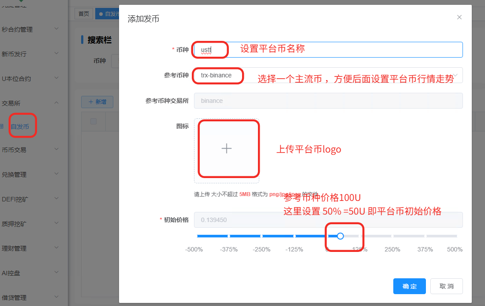
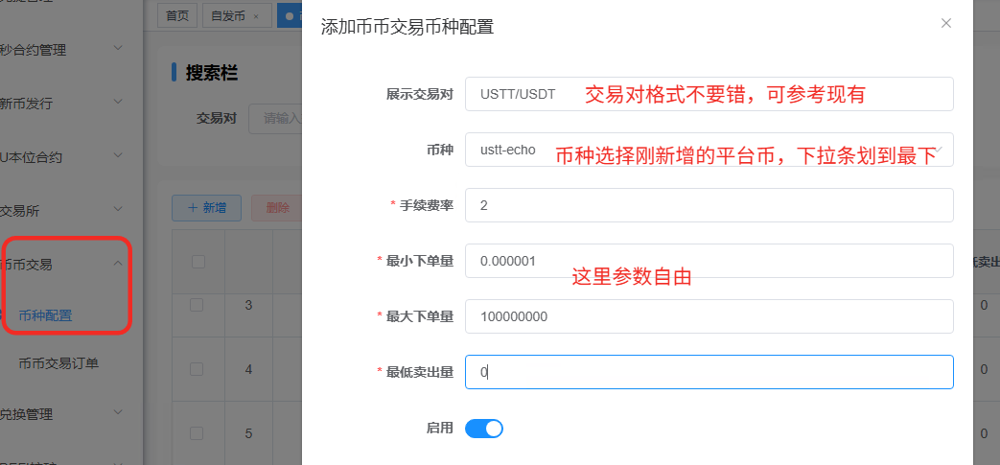
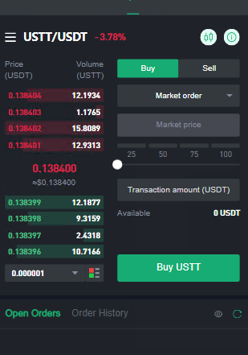
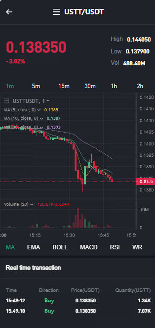

# 设置平台币









用户端已显示刚添加的USTT 币种交易对。




## 打赏

如果该项目对您有所帮助，希望可以请我喝一杯咖啡☕️

```bash
# USDT-TRC20打赏地址:
TTz4y9EE5DqtRAneK5iQtWNW4k9E888888
```


## 声明

源码仅用于学习交流使用！

不可用于任何违反中华人民共和国(含台湾省)或使用者所在地区法律法规的用途。

因为作者即本人从未参与用户的任何运营和盈利活动。 

且不知晓用户后续将程序源代码用于何种用途，故用户使用过程中所带来的任何法律责任即由用户自己承担。            

```
！！！Warning！！！
项目中所涉及区块链代币均为学习用途，作者并不赞成区块链所繁衍出代币的金融属性
亦不鼓励和支持任何"挖矿"，"炒币"，"虚拟币ICO"等非法行为
虚拟币市场行为不受监管要求和控制，投资交易需谨慎，仅供学习区块链知识
```

